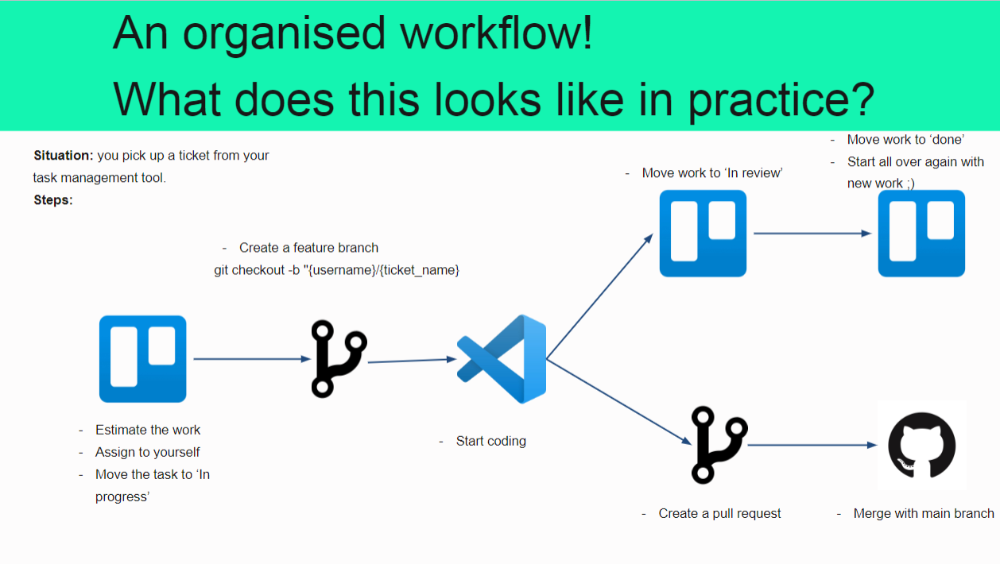

# CRM-project: Citrus Contact

Our main, actual, real repo for the project.

It's a CRM with a different C. This software is used to manage the user's contacts and their relationships, which can be either professional or personal. In addition, it's also _may_ have a instant message feature.

## Contribute guideline

We will follow a **trunk-based approach**, where developers collaborate on a single branch and avoid creating other long-lived feature branches. We will create a branch, code it, pull request it and merge it. Then we will create another branch to code other part of the software. This avoid merge hell when we finalize the product.

For coding style, follow the `README.md` in each folder `frontend` and `backend`.

In addition, it's better to **commit frequently**. This way, we can easily see the reasons for code change and follow the thought process of the developer. Don't mistake between commit and push/pull request though.

**Exception**: For documentation and `README` file (simple text files), you can just push them directly. No need to pull request.

**TLDR:** Use branching feature, commit a lot and use pull request.

### Example workflow

(From lecture 2 slides)

## Reading resources

<https://www.toptal.com/software/trunk-based-development-git-flow>
